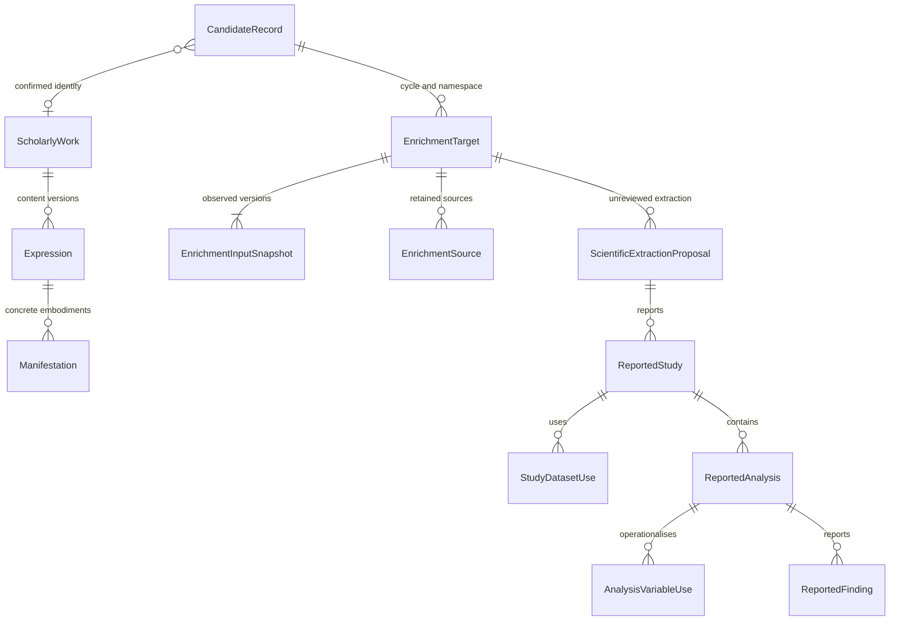
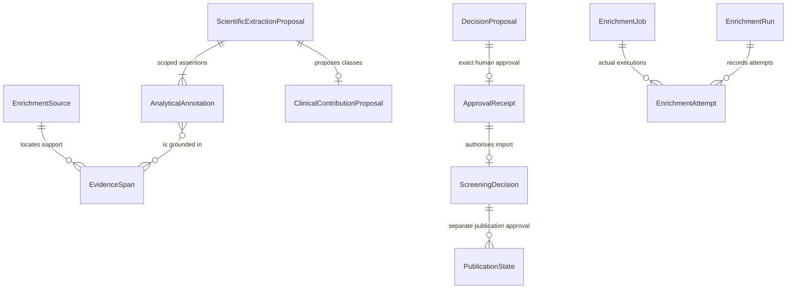

# Governed archive architecture

This is the consolidation specification and a generated inventory of the existing
implementation. **The transition is not complete.** The inventory distinguishes
implemented code, configured storage, observed runtime and the required target.
The normative concepts remain in `ontology/cile-review-profile.yaml`; this document
does not create alternative scientific entities or supply missing decisions.

## Conceptual relationships

The first relation is the **required** identity cardinality: many retained
CandidateRecords may ultimately refer to one curator-confirmed work, while a
candidate has at most one current confirmed work. The existing V2 SQL's
`UNIQUE(review_id,work_id)` restricts this to one candidate per work per review.
That is a documented physical mismatch to correct in an additive migration; it
must not be solved by deleting or silently merging candidates.

An Expression is a version of intellectual content. A Manifestation is an
embodiment, including acquired bytes or a locator whose acquisition has not
succeeded. A candidate-bound source may exist before an Expression/Work identity
is resolved. Its later identity link must be an explicit sourced assertion;
consolidation must not fabricate a work to satisfy a foreign key.

`StudyDatasetUse` is a dataset **as used within a reported study**, not an inferred
global dataset identity. Analysis/dataset use, variable/dataset use and
finding/variable references can repeat. Their present IDs are local to a proposal
and must always be interpreted with `proposal_id`; similarly named variables in
different analyses do not share an identity by default.

Sources, evidence locations, paraphrases and analyst annotations are distinct.
An external comment is an ingestion source, not automatically an EvidenceSpan,
ReportedAnalysis or ScreeningDecision. Preserve its original bytes, observed
version, external reference and effective review state. No parser is authorised
to invent study/analysis membership where the annotation is ambiguous.

An intended job differs from its actual attempt; an attempt differs from a
persisted source/proposal/import receipt. Browser loading/error states belong
only to transport. A stored abstract, manual annotation or classification proposal
does not establish assessment completion, acceptance or corpus membership.

## Logical and physical dictionary

Run `python3 scripts/architecture/catalogue.py` to regenerate:

- `physical-schema.json`: all 71 implemented SQL table definitions, columns,
  foreign keys, unique/partial indexes, checks in original DDL, append-only
  triggers and source migrations;
- `traceability.csv`: all 569 columns mapped to existing ontology classes/slots,
  SQL types, primary-key positions, effective nullability and implementation status.

These are schema inventories built in an isolated SQLite database, not claims
that 71 tables are deployed. The configured enrichment Durable Object uses 38;
the other 33 belong to prepared V2 storage. Actual counts and schema integrity
require the authenticated, commit-bound runtime receipt.

The dictionary deliberately exposes ordinary SQLite `TEXT PRIMARY KEY` columns
that remain nullable without `NOT NULL`, and reference fields without a physical
foreign key. Code validation is not described as a database constraint. Original
payload JSON is closed-schema submission evidence. Migration 0007 makes repeated
facts and dataset/variable/evidence links queryable relations. The current writer,
private reader, adjudication input and public reader use the verified relational
graph. See [extraction-relations.md](extraction-relations.md) for cardinalities,
identity, transaction and backfill rules. Dated runtime receipts distinguish
this configured implementation from migrations actually executed in production.

## Authority and version rules for the transition

The current sources and their writers/readers are in [sources.md](sources.md).
They remain current until a verified switch; this document does not relabel
unmigrated sources as retired.

The target is the **existing private SQLite archive**, with immutable external
source captures and governed imports. No new database service is required.

1. Preserve internal candidate IDs, target IDs, proposal IDs, source IDs and
   historical versions. An external DOI, URL, title or issue ID is an alternative
   identifier/provenance reference, never a replacement universal identity.
2. An ingress item gets its own persistent internal ID, original source/version,
   content digest, transformation version and import receipt. Replaying the same
   item returns the same receipt. An edited comment is a new observed revision;
   do not pretend GitHub supplied its unobserved editing history.
3. Each assertion retains its source, scope, effective time and verification state.
   A reviewed bibliographic correction may supersede its specifically identified
   earlier assertion. A contradictory provider response remains another assertion
   and opens a conflict; it cannot silently win by arrival time.
4. Preserve unresolved annotation identities privately with an exception receipt.
   Exact candidate markers alone do not verify the content version or scientific
   claims. Old manifestation results cannot be reattached to a revised work by
   title similarity.
5. All writes validate schema, authority, scope and the expected current revision
   before one atomic transaction. Stable idempotency keys and compare-and-swap
   versions prevent duplicate writes and lost updates. Scientific supersession
   appends history and retires the former current pointer atomically.
6. Byte retention precedes the referencing transaction and requires hash readback.
   A failed transaction leaves a recoverable unattached object, never a successful
   source receipt. An outbox records external delivery intent; an external comment
   or response is not the database commit. Reconciliation must enumerate orphan
   objects and incomplete outbox entries, retaining ambiguous material.
7. Publication requires a separate current allowlist projection and rights gate.
   Access and redistribution are different assertions. Withdrawal invalidates the
   current projection/revision and removes the item from regenerated exports while
   preserving history. A retained historic public document must not reappear solely
   because a previous software version is restored.

The target switch must atomically identify which importer owns each domain. Existing
GitHub/CSV processes then become governed ingress or are disabled. They must not
continue to supply independently authoritative current states. Public reading files
are rebuilt exclusively from the same accepted archive revision, never by merging
GitHub comments, CSVs and a live API in the browser or a build-time aggregator.

## Counting contract

| Unit | Count exactly | Do not substitute |
|---|---|---|
| Search occurrence | A recorded returned occurrence within a query execution | Candidate or work count |
| Candidate | Distinct retained `candidate_id` in the specified cycle/perimeter | DOI/title/issue count |
| Work | Distinct confirmed `work_id` | Provisional candidate count |
| Expression / manifestation | Distinct version / embodiment IDs respectively | PDF URL count as work count |
| Study / analysis | Distinct proposal-scoped study / analysis IDs, with the applicable proposal revision | Paper count |
| Manual annotation coverage | Candidates with a valid, current, identity-bound annotation under a named coverage rule | Scientific completeness |
| Assessment completion | Explicit applicable F0–F5 outcome under its versioned completion policy | Accepted F6–F7 receipt or full-text availability |
| Assessed corpus | Works satisfying current screening, access and publication decisions | Entire operational register |

At the same archive revision and perimeter, sheets, filters and statistics use
the same definitions. Unknown/incomplete transport cannot become observed zero.
No frontend category extraction may silently promote an alternative/proposed label
to an accepted scientific class. Register and assessed-corpus views remain distinct.

## Acceptance and rollback

The transition requires a complete private backup and a restore rehearsal, a
per-item migration ledger, and full-population parity across source/destination.
Verify create/replay, competing update, failure recovery, supersession and withdrawal
through the actual writer, stored tables, public API, sheet, filter and count.
Verify that private notes, reviewer identities, original source text and restricted
documents remain absent. A diagram, an empty migration, a green offline test or
an unavailable live endpoint cannot close these gates.

Preserve old source captures as history. On rollback pause writers, select the last
compatible verified release, retain all new events, and apply current withdrawal
restrictions. Never restore an old public snapshot in isolation from its current
publication/rights decisions. The completed Git restore is recorded in the
[implementation record](../operations/architecture-consolidation-2026-09-19.md);
the isolated private-state restoration is now evidenced separately. Production
replacement recovery and the full authority cutover remain open gates.

The implemented bounded encrypted backup and isolated restore procedure is in
[preservation.md](preservation.md). Its runtime receipt is required before a
content migration; repository tests alone do not certify a production backup.
