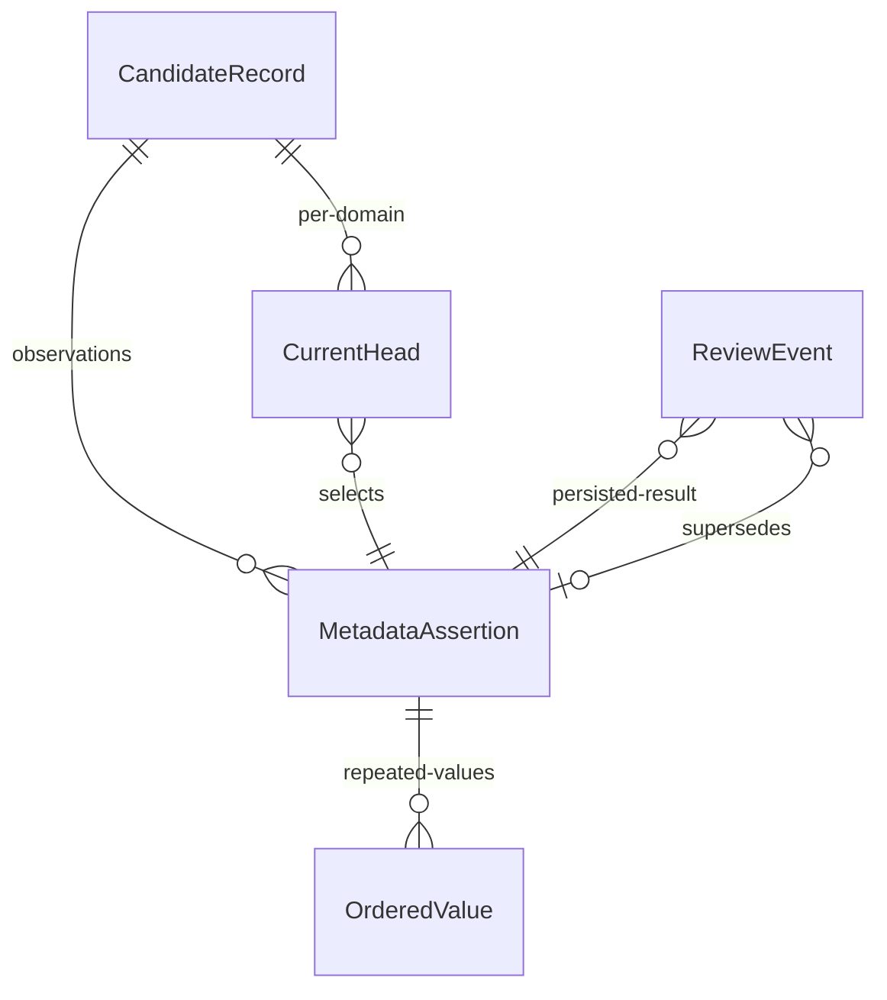

# Candidate bibliography and coverage archive — staged implementation

Profile 0.4.5 and migration `0009_candidate_archive.sql` implement these relations
inside the **existing** private SQLite Durable Object. They introduce no new
service. This is a tested staging step, **not a completed authority cutover**.
`review_queue.csv` and the coverage ledgers remain current authorities until the
production backup, full migration, sole-writer transition and readback gates pass.

## Concepts, identity and cardinality



`CandidateRecord` retains the existing candidate identifier and cycle. It is not a
Work, Expression, author Agent or inclusion decision. An assertion is a sourced
observation within one closed domain: bibliography, abstract availability,
retrieval or access. Each has a domain-specific typed row, not a generic JSON
payload used for ordinary queries. Original closed input JSON is retained solely
as immutable private source evidence and verified during integrity audits.

The bibliography's author string remains an **unresolved source assertion**;
splitting names would not establish Agent identity. A DOI remains an asserted
identifier, not the candidate's primary key. Coverage's `observed_title` and
`observed_doi` describe what that particular check used. They do not compete with
the current bibliography. Their divergence can therefore be inspected without
overwriting either observation.

There is at most one current head per candidate, cycle and domain. Multiple
assertions may disagree. `observe` preserves an additional assertion and exposes
its ID in `unresolved_revision_ids`; arrival time cannot replace a head. Only an
explicit `supersede` with the expected version selects a replacement. Retired
assertions, receipts and source captures remain immutable. No candidate-to-work
link is created by these operations.

## Logical and physical contract

| Physical relation | Key and relations | Update rule |
|---|---|---|
| `enrichment_candidate_records` | PK `(candidate_id, cycle_id)` | Insert only; stable identity |
| `enrichment_candidate_revisions` | PK `revision_id`; candidate FK; unique revision/candidate/cycle/domain tuple; source commit, content digest and object key | Immutable sourced assertion |
| `enrichment_candidate_bibliography` | PK/FK `revision_id`; closed bibliography columns | Immutable; domain trigger |
| `enrichment_candidate_abstract` | PK/FK `revision_id`; availability and check basis | Immutable; domain trigger |
| `enrichment_candidate_retrieval` | PK/FK `revision_id`; locators and resolution basis | Immutable; domain trigger |
| `enrichment_candidate_access` | PK/FK `revision_id`; access assertion and evidence | Immutable; domain trigger; never grants redistribution |
| `enrichment_candidate_values` | PK `(revision_id, field, position)`; revision FK | Ordered, repeatable source links, query references and provider observations |
| `enrichment_candidate_heads` | PK `(candidate_id, cycle_id, domain)`; composite FK to the same scoped revision | Compare-and-swap revision counter; withdrawal cannot be automatically reversed |
| `enrichment_candidate_receipts` | PK `receipt_id`; scoped revision FK; optional previous revision FK | Insert only, inside the data transaction |

All keys are explicitly `NOT NULL`. The generated dictionary and traceability
matrix enumerate every field, SQL type, ontology mapping, check, index and FK.
Observation lexemes are text, including reported years/scores: they preserve the
source's empty or uncertain values rather than inventing numeric measurements.
Revision counters and relation positions are constrained integers. The closed
ingress schema is `schema/candidate-archive.schema.json`; the existing ontology
enums constrain candidate, review, abstract and access states. Source-specific
provider diagnostics remain bounded assertion text, not scientific statuses.

Every revision ID hashes the contract, cycle, candidate, domain, source commit
and row digest. Every command receipt hashes the complete validated command.
No internal identity is substituted with a DOI, URL, title or issue number.
The source path is fixed by the domain contract, and each migration ledger also
records its original file digest. Semicolon-delimited repeated fields become
ordered child rows; trimming separators is the only declared transformation.
Original source bytes remain recoverable from the pinned Git commit, while exact
parsed source lexemes remain in the private immutable object.

## Governed write and failure recovery

The existing authenticated, exact-deployment machine interface now accepts
`archive-candidate` and private `candidate-export`. These operations do not enable
the scheduler, change the source of scheduled target synchronisation or replace
the production register. A proposed assertion is not a verified external fact.
This mechanical importer refuses scientific decisions, topic assignments,
duplicate-target decisions and non-pending screening state. Import of future
decided records requires the separately governed approval pathway.

1. Validate the closed envelope, domain, candidate ID, fields and admissible
   states before writing. Coverage requires an existing retained candidate.
2. Find an exact existing receipt to make retries idempotent. Otherwise check
   the expected head version and legal action.
3. Retain the immutable source object and verify its digest by readback.
4. In one SQLite transaction insert the assertion, typed domain row, repeated
   values, head transition and receipt. Validate relational readback before the
   receipt. A concurrent update aborts the whole SQL transaction.
5. Return the receipt only after commit. A failure before SQL commit can leave an
   unattached immutable source object; retry reuses that same deterministic key.
   Such an object is not reported as a saved observation and must not be deleted
   as a migration shortcut. Global orphan-object inventory remains a cutover gate.

Exports include their receipt-set revision and reject a concurrent change during
reading. Withdrawal removes a domain from its current export; replaying an old
successful receipt cannot restore it. An explicit reviewed restoration procedure
is deliberately not supplied by this importer. Because production readers have
not switched, these withdrawal tests certify the staged archive, not the current
Pages site's withdrawal behaviour.

## Executed whole-population rehearsal

Run:

```bash
node scripts/architecture/preflight_candidates.mjs /private/new-migration-ledger.json
```

The script checks source bytes against pinned `origin/main`, imports **all** rows
through the real writer, replays every command, verifies every scalar/relation
and source object, and reconstructs candidate targets from SQL bibliography.
The existing public index then accounts for every candidate without fetching
Pages. It captures an encrypted backup, restores it into a fresh store and runs
the full architecture integrity audit. It makes no network calls or production
writes. Its private ledger gives origin, destination revision, transformation,
receipt and outcome for each row.

`candidate-preflight-2026-09-19.json` records the pinned population and result:
294 bibliography rows, 294 abstract assessments, 294 retrieval observations and
294 access assessments. The isolated database has 55 tables; **46 remains the
last observed deployed table count**. The extra nine tables are not described as
already deployed. The 49 additional source identifiers identified by the intake
census remain preserved exceptions in that private ledger; this import does not
register or reconcile them automatically.

Tests cover exact replay, conflicting assertions, CAS supersession, concurrent
writes, failure between object/SQL/receipt, retry, withdrawal, prohibited
republication, signed ingress, private-field isolation and whole-population
encrypted restoration. The source commit contains the subsequent reviewed
metadata fixes through #807; earlier observations are not silently substituted.

## Remaining release gates

- Obtain a verified backup of the current deployed state and recover the signed
  service; the recent production annotation acquisition is still failing.
- Execute this migration against that protected deployment, preserving a private
  per-item ledger and verifying every source/destination revision and replay.
- Move the sole intake writer, reviewed metadata repairs and each coverage writer
  onto archive commands with commit/readback receipts before issue finalisation.
- Import intake-access receipts and reading support with explicit precedence;
  do not reconstruct access or reading rights from a bibliography field.
- Switch target synchronisation, the register/support builders and public readers
  together to one compatible archive revision, then retire their competing writers.
- Preserve additional intake identities and proposed associations without forced
  work reconciliation; complete the other preservation scopes and orphan census.

Until those gates pass, this implementation and its green tests must not be used
to claim that the user's end-to-end architecture criterion is satisfied.
