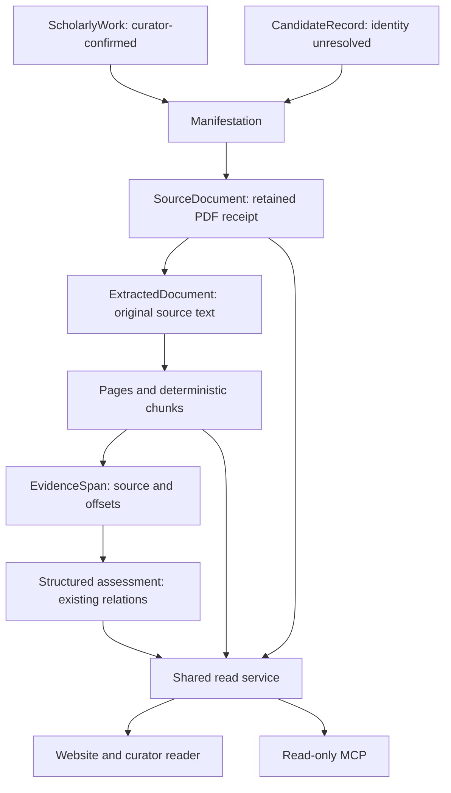

# Document repository and MCP implementation audit

Baseline inspected before implementation: `ae28aa51a9cfe99e58cfbdfbd5f751fed2981d8a`
(main, PR #805), 19 September 2026. This is an implementation audit, not a
certificate of private production coverage.

## Current state and gaps

| Capability | State | Evidence and consequence |
|---|---|---|
| Canonical identity | Implemented, no included works | `papers.csv`, screening/publication registries contain zero rows. The operational queue has 294 CandidateRecords. Candidate IDs must not be presented as confirmed works. |
| Access verification | Partial coverage | `access_coverage.csv`: 86 open, 35 restricted, 173 unknown; 29 have `public_full_text` access kind. An access observation is not a retained-document receipt. |
| Governed acquisition | Implemented | `scripts/oa_acquisition.py` validates exact authorised origins, public DNS, redirects, size, PDF signature and terminator. Parser validation still needs strengthening. |
| Original bytes | Partially implemented | `enrichment_documents` and content-addressed `document:*` private KV; 4 MiB per document, digest/readback and duplicate byte keys. Runtime population cannot be inferred from seed configuration. |
| Rights | Partially implemented | Private default; verified CC BY/BY-SA 4.0/CC0 permits public delivery. Acquisition and redistribution are separate. Explicit extraction/provenance and rights evidence need a governed extension. |
| Manifestation/document distinction | Inconsistent | `enrichment_documents` is mapped as Manifestation and also acts as an acquired-document receipt. There is no separate addressable manifestation relation. |
| Text extraction | Partial | Native `pdftotext -layout`, retained source digest, source spans and UTF-16 offsets exist. There is no verified page index, extraction receipt, deterministic chunk index or lexical full-text index. |
| Scientific extraction | Implemented | CILE-ENRICH-1, immutable proposals, normalised proposal-scoped facts/relations and evidence spans. Completion/acceptance gates remain separate from document acquisition. |
| Document reading | Partial | Public rights-gated PDF response, Range/HEAD support and paper-sheet link; private curator route. No coherent page/structured-data navigation. |
| Query/MCP | Absent for full text/MCP | Existing closed research, completion and asset projectors must be reused. No MCP server or bounded full-text retrieval. |
| Unified authority | Incomplete, pre-existing | CSV authority, Pages-derived target sync and GitHub annotation ingress are documented in `sources.md`. This change must not declare the wider consolidation finished. |

The selected backend remains the existing SQLite Durable Object and its private
content-addressed KV. The prior D1/R2 permission failures are documented in
`docs/operations/enrichment-storage-decision.md`; no new service, credentials,
paid plan or binary Git corpus is justified here.

## Production boundary

Run [35451813075](https://github.com/colazeta/criminal_infiltration_in_legal_economy_review/actions/runs/35451813075)
passed validation, then failed the pre-deployment preservation gate:
`backup_transport`, phase `catalogue`, HTTP 503; `predeploy_backup_gate_failed`.
Worker deployment, migration, activation and PDF retention were skipped.
This session has no private service credential. Consequently retained bytes,
private proposals and completion counts are **unobserved**, not zero.
The preservation gate must pass before production migration or backfill. It
must not be disabled to release this feature.

## Proposed source flow

No canonical work is fabricated for the current candidate-only population.
Existing `source_id`, `document_id`, proposal and evidence identifiers remain
unchanged. New manifestation identities describe source embodiments, never
scientific identity resolution. Current canonical identities remain governed by
the existing registries and explicit curator process.

## Migration and implementation order

1. Add migration 0009 and matching bundle in `curator-app/`: manifestation
   bindings, extraction receipts, page/chunk index. Extend ontology mapping,
   profile and physical dictionary in the same change. Reuse existing document
   bytes, source text and proposal/evidence tables.
2. Implement document validation/indexing and a private, bounded coverage audit.
   Verify source text hash, byte hash, page partition and input scope. Preserve
   earlier text and offsets; re-extraction never silently rewrites old evidence.
   Legacy rows lacking an extraction receipt remain explicit blockers.
3. Extend the existing governed retention runner to persist extraction receipts;
   provide a bounded resumable legacy backfill. Failures remain per-record
   failures. No URL, seed or fixture counts as a production acquisition.
4. Add a rights-aware document-library/read service and page navigation on the
   platform using existing public/private delivery. Public text follows the same
   current document rights gate as public PDF bytes.
5. Only after document tests pass, implement MCP Streamable HTTP with fixed
   read-only tools/resources, structured filters, bounded lexical retrieval,
   proposal-scoped evidence and explicit missingness. No vector infrastructure.
6. Test integrity, identity, rights withdrawal, private access, input/output
   bounds, injection, deterministic queries and shared IDs. Run the repository's
   required complete validation and regenerate architecture artefacts.
7. Submit the concrete reviewed branch. Production rollout must preserve and
   restore-check the current archive, deploy, backfill/index, audit all targets,
   verify page rendering and MCP, and record live counts/timings. Without those
   receipts the definition of done remains open.

Protocol references: [MCP transports](https://modelcontextprotocol.io/specification/2025-11-25/basic/transports),
[MCP tools](https://modelcontextprotocol.io/specification/2025-11-25/server/tools),
[Cloudflare SQLite storage](https://developers.cloudflare.com/durable-objects/api/sqlite-storage-api/).

## Implemented branch and verification

The additive implementation above is present in this branch. The normative
profile is 0.4.4; all seven new tables are mapped in the model, physical schema
and browser artefact. The shared website/MCP service uses the existing source
and normalised extraction relations. Original PDFs stay in private KV, and
public full-text delivery uses the current verified redistribution gate.

The branch was rebased onto `9b0a6211b33950509c5e63180ad71af0c2f3d48f`
before the complete validation. All required AGENTS.md gates pass: repository,
ontology, model regeneration, archive/secondary/curator builders, archive/site
validation, JavaScript syntax, saturation report, **782 Python tests** and
**448 JavaScript tests** (zero failures or skips). Generated files remain
reproducible. No candidate, canonical, screening or scientific record was edited.

Tests cover real native PDF parsing and OCR on generated test documents;
rejection of HTML, truncated and forged PDFs; exact Unicode offsets; idempotent
indexing; source/byte corruption; rights withdrawal; atomic rollback at the
existing preservation budget; shared website/MCP IDs; seven read-only tools;
transport and output bounds; SQL/path/URL injection; private filter-oracle
protection; revision-scoped evidence; resumable coverage and unchanged legacy
text. Synthetic fixtures are never counted as retained literature. The local
complete Python run took 2.1 seconds and JavaScript run 6.5 seconds; these are
test-suite durations, not deployed query latency measurements.

The remote browser rejected the local preview URL with
`net::ERR_BLOCKED_BY_CLIENT`; no screenshot or successful visual validation is
claimed. Production PDF acquisition, migration, coverage census, endpoint
activation and real query timings were not performed. The scope limitations
and release sequence are detailed in the
[operator/MCP guide](../operations/document-repository-mcp.md).
The [machine-readable baseline](document-repository-baseline.json) preserves
unobserved private quantities as null.
