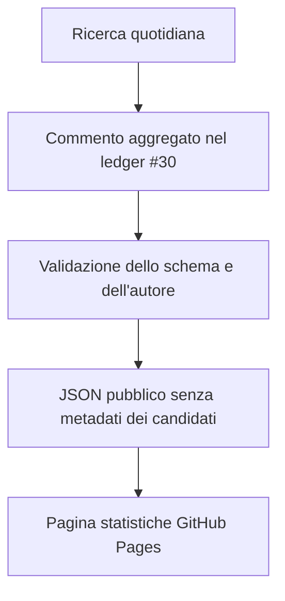

# Statistiche giornaliere della ricerca

Questa pagina spiega quali numeri vengono raccolti dalla sorveglianza accademica
quotidiana, come vengono calcolati e che cosa **non** possono dimostrare. La
[pagina pubblica delle statistiche](https://colazeta.github.io/criminal_infiltration_in_legal_economy_review/stats.html)
mostra soltanto aggregati; titoli e metadati dei candidati restano nelle issue di
intake.

## A quale domanda rispondono?

Le statistiche servono a capire:

1. se la ricerca quotidiana è stata eseguita correttamente;
2. quanti risultati ha dovuto esaminare;
3. quante occorrenze ripetute sono state ricondotte allo stesso risultato;
4. quanti risultati erano già conosciuti;
5. quanti nuovi candidati sono entrati nella coda di revisione umana;
6. quale fonte ha aggiunto candidati che l'altra non aveva trovato.

Non misurano direttamente la qualità scientifica del corpus. Un nuovo candidato
non è ancora un paper eleggibile e un paper eleggibile non è automaticamente
pubblicato.

## Come circolano i dati



Il [ledger GitHub #30](https://github.com/colazeta/criminal_infiltration_in_legal_economy_review/issues/30)
contiene un commento strutturato per ogni batch `ACADEMIC-YYYY-MM-DD`. La
pubblicazione giornaliera accetta soltanto commenti dell'autore autorizzato e
conformi a [`schema/surveillance-run.schema.json`](../../schema/surveillance-run.schema.json).
Ogni commento usa un involucro canonico composto da una sola riga tecnica,
marker e oggetto JSON: testo aggiuntivo non viene accettato, così il ledger non
diventa accidentalmente una seconda copia dei metadati dei candidati.

## L'unità di osservazione

Una riga equivale a **una giornata di sorveglianza**, calcolata in
`Europe/Rome`. Sia l'inizio sia la fine della finestra devono ricadere nella
data dichiarata: non è possibile comprimere una ricerca di più giorni in una
sola riga quotidiana. Ogni fonte attesa compare una volta con uno stato
esplicito:

- `completed`: tutte le query pianificate della fonte sono terminate;
- `failed`: la fonte non ha prodotto un risultato utilizzabile;
- `not_run`: la fonte non è stata avviata.

Lo stato complessivo è:

- `completed` se tutte le fonti attese sono complete;
- `partial` se almeno una è completa e almeno una no;
- `failed` se nessuna fonte è completa.

Solo una giornata `completed` alimenta i conteggi di volume e novità. In una
giornata parziale o fallita, i totali sono `null`: non vengono trasformati in
zero. Se una finestra di 7 o 30 giorni non contiene neppure una giornata
completa, anche i relativi totali sono `null`; diventano zero soltanto quando
almeno una ricerca completa ha misurato davvero zero.

## Le tre metriche principali

| Metrica | Formula | Decisione che supporta |
|---|---|---|
| **Nuovi candidati** | lavori non già noti inviati alla issue di intake | Quanto nuovo materiale plausibile è entrato nella coda umana? |
| **Tasso di nuovi candidati** | `intake_candidates / unique_results` | Quale quota dei risultati unici produce un candidato nuovo e persistente? |
| **Completezza delle fonti** | fonti completate / fonti attese | Possiamo interpretare i conteggi oppure una parte della ricerca è fallita? |

La quota è `null` quando il denominatore è zero. Una ricerca completata con zero
risultati è invece registrata come uno zero reale.

## I conteggi diagnostici

I numeri seguono questo percorso. Non devono essere sommati come se fossero la
stessa cosa.

| Passaggio | Definizione |
|---|---|
| **Occorrenze restituite** | Ogni risultato di ogni query; lo stesso lavoro può comparire molte volte |
| **Risultati unici** | Record rimasti dopo la riconciliazione interna di DOI, identificatori e titolo/anno |
| **Già noti** | Risultati unici presenti nel registro o in una precedente issue di intake |
| **Nuovi candidati** | Risultati non già noti valutati come `plausible_core`, `plausible_contextual` o `uncertain` e persistiti in una issue di intake |
| **Non inoltrati** | Risultati non già noti che non hanno superato il triage di intake; non sono esclusioni scientifiche e non alimentano il tasso di nuovi candidati |
| **Identità irrisolta** | Record che non possono essere confrontati con sufficiente affidabilità |

Per una giornata completa deve valere questa riconciliazione:

```text
risultati unici = già noti + nuovi candidati + non inoltrati + identità irrisolta
```

Vengono inoltre conservati il numero di possibili duplicati e i conflitti di
metadati. Sono indicatori di cautela, non paper aggiuntivi.

## Confronto tra le fonti

Il contratto corrente accetta esattamente le due fonti attive dichiarate nella
governance: Consensus ed Exa. Un nome diverso rende invalido il run; una futura
fonte richiede prima una modifica revisionata di governance, schema e
validazione. Per ciascuna fonte vengono registrati:

- query pianificate e completate;
- occorrenze restituite;
- risultati unici all'interno della fonte;
- candidati intercettati;
- candidati trovati soltanto da quella fonte;
- limiti, cap, errori e codice del fallimento.

I candidati intercettati da più fonti possono comparire in più righe. Per questo
la somma per fonte non coincide necessariamente con il totale dei candidati
unici. I candidati esclusivi misurano invece il contributo marginale della
singola fonte. Nella tabella pubblica, esecuzioni e query descrivono la salute
tecnica della fonte anche nelle giornate parziali; occorrenze, risultati e
candidati vengono invece sommati soltanto per giornate interamente complete.
Poiché le fonti attive sono esattamente due, il numero esclusivo di una fonte è
anche verificato come: candidati totali meno candidati intercettati dall'altra
fonte.

## Finestre temporali

La pagina mostra finestre di 7 e 30 giorni ancorate all'ultima giornata presente
nel ledger, non all'orologio del browser. Questo rende il risultato riproducibile
e impedisce che un sito non aggiornato sposti silenziosamente le finestre.

Il grafico compare soltanto dopo almeno otto giornate complete. Prima di quella
soglia vengono mostrate schede e tabella: pochi punti non vengono presentati
come una tendenza.

## Confine con i cicli formali

La sorveglianza quotidiana è un canale di allerta. Non sostituisce E1, E2 ed E3 e
non entra nella regola di arresto. Le metriche di saturazione usano soltanto
cicli formali completi, con tutti i nuovi candidati valutati e nessun errore di
recupero irrisolto.

## Protezione dei dati e verificabilità

Il ledger contiene anche il riferimento canonico all'eventuale issue di intake
per lo stesso batch nello stesso repository. URL e numero devono coincidere. Il
workflow recupera anche quella issue e verifica autore, tipo, titolo e campo
`Batch ID`; il ledger #30, una pull request o un'issue di un altro batch non
possono convalidare il conteggio dei candidati. La sezione `Candidate records`
è un manifest JSON: ogni elemento ha un ID univoco legato al batch e campi
controllati, e la lunghezza dell'array deve coincidere con
`intake_candidates`. Testo segnaposto o un totale dichiarato senza record non
sono accettati. Anche valutazioni intake e attribuzione alle fonti vengono
riconciliate con i conteggi aggregati. Le tre salvaguardie dell'issue devono
essere tutte spuntate. Il workflow verifica inoltre che il commit dichiarato
esista nel repository e appartenga alla storia di `main`, così la versione del
registro usata per la deduplicazione resta auditabile. Il log delle query nella
issue di intake è un secondo manifest JSON: il numero di query per fonte deve
coincidere con quelle pianificate e ogni `query_id` citato da un candidato deve
esistere e appartenere alla fonte dichiarata. L'issue deve essere stata creata
durante la finestra e il commento nel ledger dopo la sua chiusura, sempre nello
stesso giorno di Roma. Un commento modificato non viene più considerato
append-only ed è rifiutato. Una ricerca live delle issue deve inoltre trovare
esattamente una sola issue con il titolo del batch, coincidente con il numero
registrato nel ledger. Il JSON pubblico
espone soltanto conteggi, stato tecnico, data e
l'informazione che una issue è stata creata; non ne pubblica il collegamento.
Né il ledger né il JSON pubblico contengono:

- titoli, autori, DOI o abstract dei candidati;
- query complete;
- note dei revisori o citazioni probatorie;
- decisioni di eleggibilità o pubblicazione.

Il workflow non accetta commenti duplicati per la stessa data, record con conti
che non tornano o commenti strutturati di autori non autorizzati. Se il ledger
non può essere letto o validato, il nuovo sito non viene pubblicato e resta
online l'ultimo rilascio valido.

## File tecnici

- Contratto del singolo run: `schema/surveillance-run.schema.json`
- Contratto dell'export: `schema/research-stats.schema.json`
- Validazione e calcolo: `scripts/metrics/surveillance.py`
- Recupero del ledger: `scripts/metrics/fetch_surveillance_ledger.py`
- Generazione JSON: `scripts/metrics/build_research_stats.py`
- Pagina pubblica: `site/stats.html`
